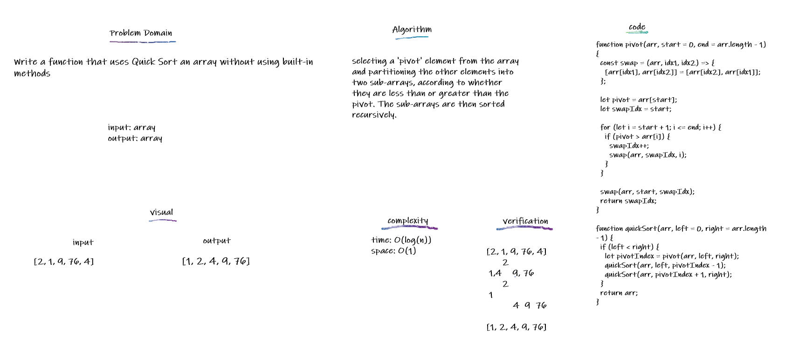

## Quick Sort

QuickSort is a Divide and Conquer algorithm. It picks an element as pivot and partitions the given array around the picked pivot

## Challenge

Write a function that uses Quick Sort an array without using built-in methods

## Approach & Efficiency

selecting a 'pivot' element from the array and partitioning the other elements into two sub-arrays, according to whether they are less than or greater than the pivot. The sub-arrays are then sorted recursively.

Big O of time --> O(log(n)) Big O of space --> O(1)

## API

