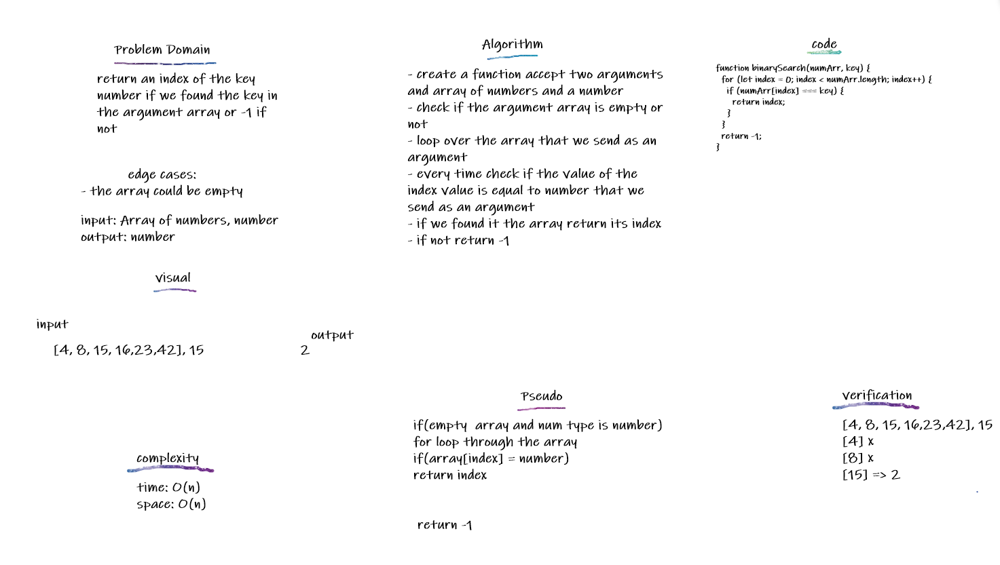

## array Binary Search

a sorted array and the search key return the index of the array’s element that is equal to the search key, or -1 if the element does not exist.

## Challenge

Write a function called `BinarySearch` which takes in 2 parameters: a sorted array and the search key. Without utilizing any of the built-in methods available to your language, return the index of the array’s element that is equal to the search key, or -1 if the element does not exist.

## Approach & Efficiency

making a for loop that loops through the input array , and compare the array number if it aqual to the key or not and the return the index of the key in the array if it contain the key or return -1. it took 15mins.

## Solution

