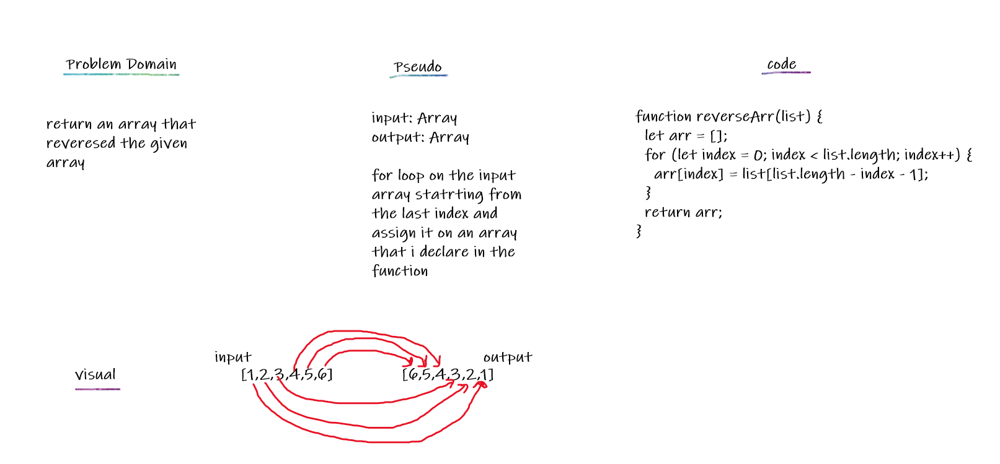

## Array Reverse

Reverse an array without using any built in methods.

## Challenge

Write a function called reverseArray which takes an array as an argument. Without utilizing any of the built-in methods available to your language, return an array with elements in reversed order.

## Approach & Efficiency

making a for loop that loops through the input array starting at the last value, and assign that value into the another array. Then, then keep moving throw the index from the last to the zero index and assign the values in the arr that i defind in the function. Doing a for loop was what came to mind first, and it felt like a straight forward way to approach it. it took 10mins.

## Solution

