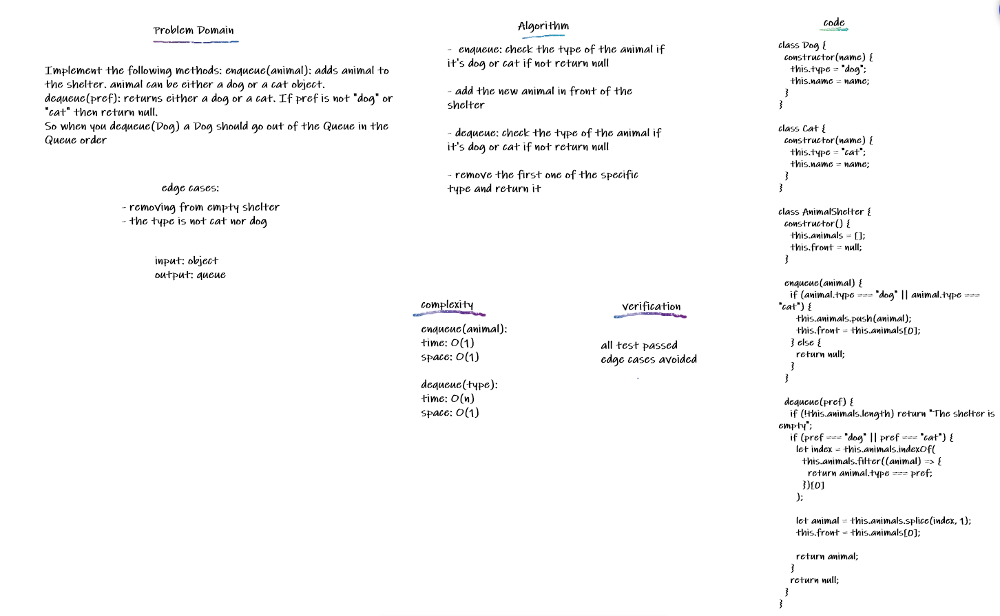

## Animal Shelter

Create a class called AnimalShelter which holds only dogs and cats. The shelter operates using a first-in, first-out approach. And Data can be recogonized if a Dog or Cat

## Challenge

Implement the following methods: enqueue(animal): adds animal to the shelter. animal can be either a dog or a cat object. dequeue(pref): returns either a dog or a cat. If pref is not "dog" or "cat" then return null.

So when you dequeue(Dog) a Dog should go out of the Queue in the Queue order

## Approach & Efficiency

for enqueue(animal) it is a normal enqueue just appends to the Queue for dequeue(pref) it will check for front if not it will loop on current.next till if finds it

## API

