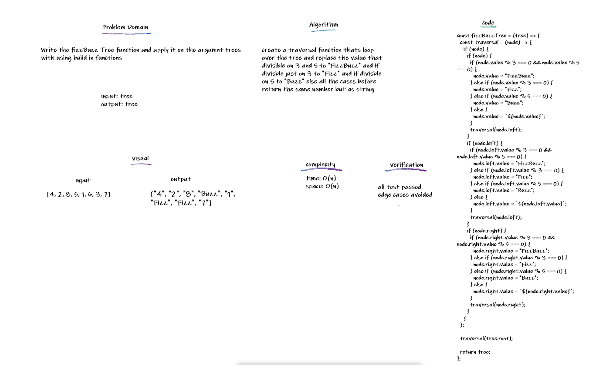

## fizzBuzz Tree

takes an tree as an argument

- If the value is divisible by 3, replace the value with “Fizz”
- If the value is divisible by 5, replace the value with “Buzz”
- If the value is divisible by 3 and 5, replace the value with “FizzBuzz”
- If the value is not divisible by 3 or 5, turn the number into a String.

## Challenge

Write the fizzBuzz Tree function and apply it on the argumnt trees with using build in functions

## Approach & Efficiency

copied the tree to a variable the used the depth method to tranverse through while changing values of nodes

## API

