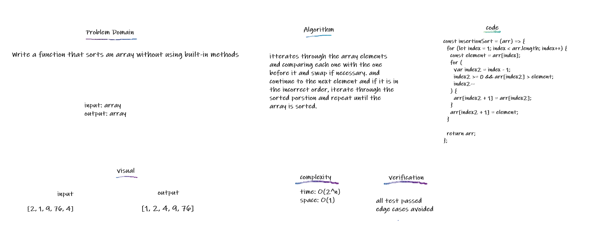

## Insertion Sort

Insertion Sort is a sorting algorithm that traverses the array multiple times as it slowly builds out the sorting sequence

## Challenge

Write a function that sorts an array without using built-in methods

## Approach & Efficiency

itterates through the array elements and comparing each one with the one before it and swap if necessary. and continue to the next element and if it is in the incorrect order, iterate through the sorted porstion and repeat until the array is sorted.

## API

