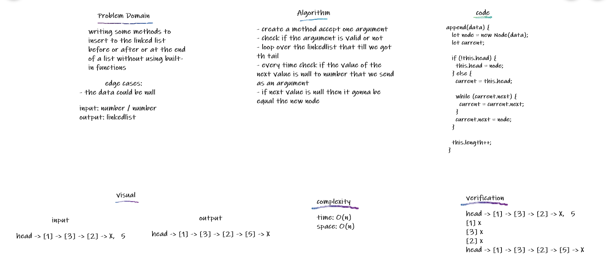
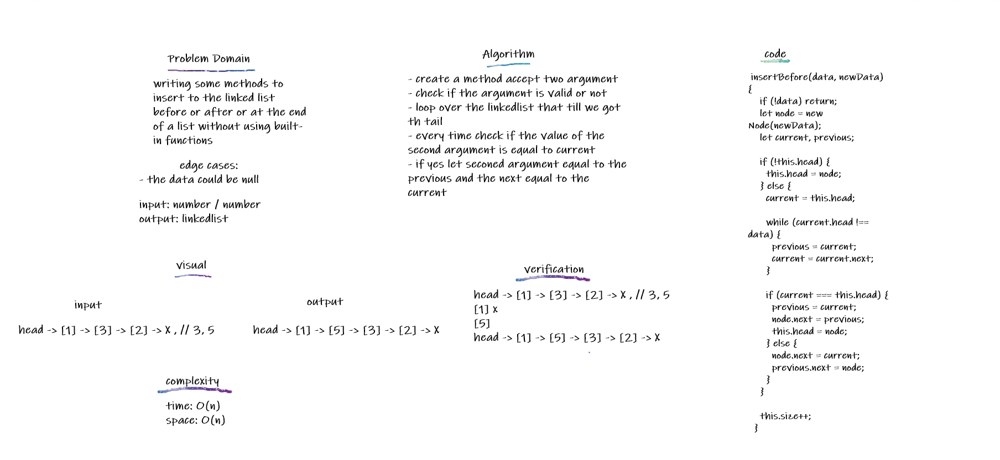
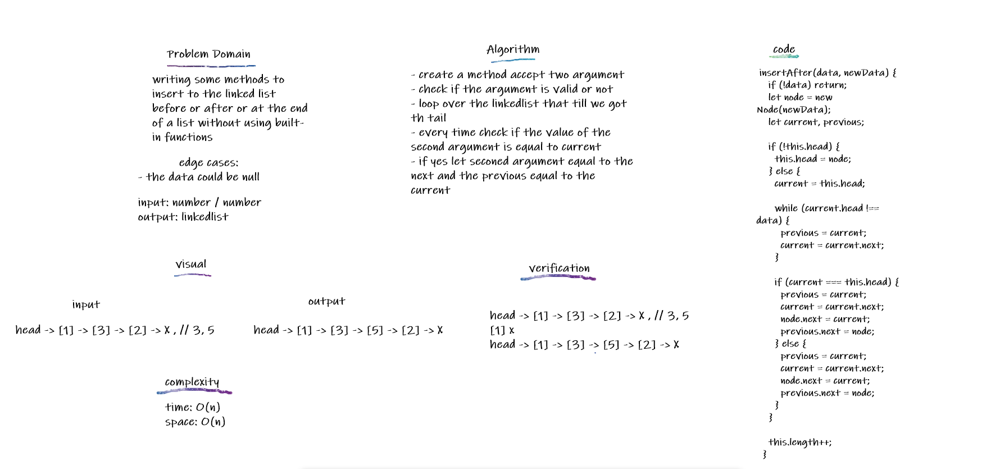

## Singly Linked List

Type of Data structure application where data in the list are considered to be nodes, each node have its value and a refarence to the next node in the list and the fist node in the list called head

## Challenge

writing a class function that create linked lists can be used ti insert,search and print it without using build-in methods

## Approach & Efficiency

for the insert it will be an if statment if there is items or not yet in the LL for the search it is a while loop and the str loops over the items time=>O(n) space=>O(n)

## Solution

created the class to create the node inside the linked list for the insert it will create a node sets the next value as the head value and resets the head for the search it is a while loop as long as the current equal True and the str loops over the items and prints them

/////////////////////////////////////////////////////////////////////////////////////

## Linked list insertions

Inserting to a linked list using diffrent kind of methods in order to insert new nodes in the desired spot

## Challenge

writing some methods to insert to the linked list before or after or at the end of a list without using built-in functions

## Approach & Efficiency

for before and after it will be a loop to search for the item then insert before or after it and to insert at the end it will loop to the end of the LL then insert the node time=>O(n) space=>O(n)

## API

for before and after it will be a loop to search for the item then change the .next value for both the new item and the current item to insert before or after it and to insert at the end it will loop to the end of the LL then insert the node and change the .next for the current item

