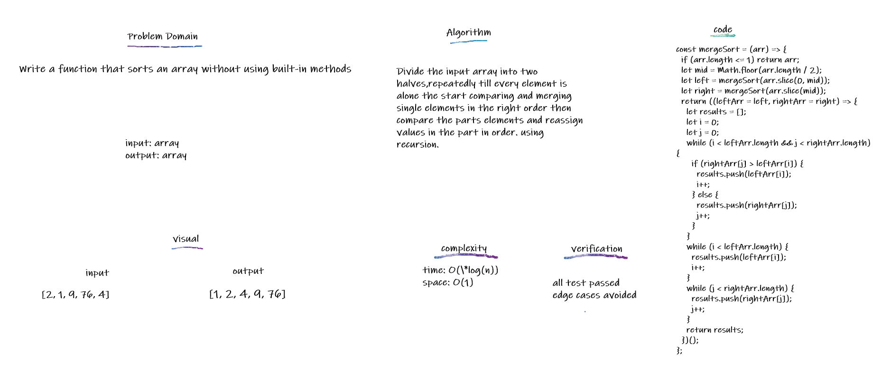

## Merge Sort

Merge Sort is a Divide and Conquer algorithm. It divides the input array into two halves, calls itself for the two halves, and then merges the two sorted halves.

## Challenge

Write a function that sorts an array without using built-in methods

## Approach & Efficiency

Divide the input array into two halves,repeatedly till every element is alone the start comparing and merging single elements in the right order then compare the parts elements and reassign values in the part in order. using recursion.
Big O of time --> O(n\*log(n)) Big O of space --> O(1)

## API

