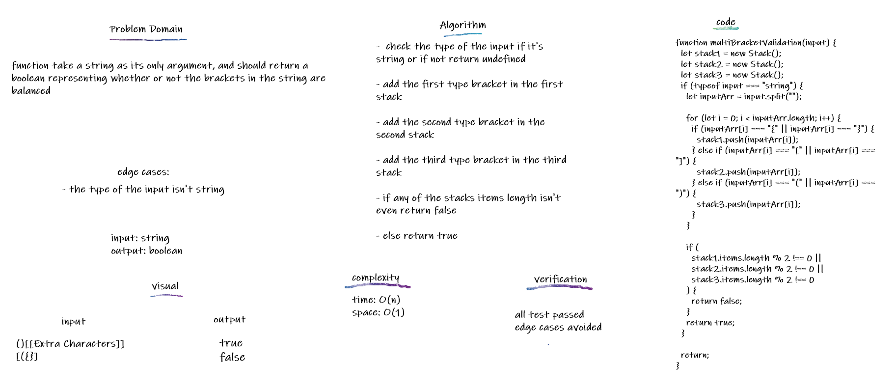

## Multi bracket validation

checks if the brackets in a given

## Challenge

function take a string as its only argument, and should return a boolean representing whether or not the brackets in the string are balanced

## Approach & Efficiency

check the type of the input if it's string or if not return undefined:

- add the first type bracket in the first stack

- add the second type bracket in the second stack

- add the third type bracket in the third stack

- if any of the stacks items length isn't even return false

- else return true

## API

