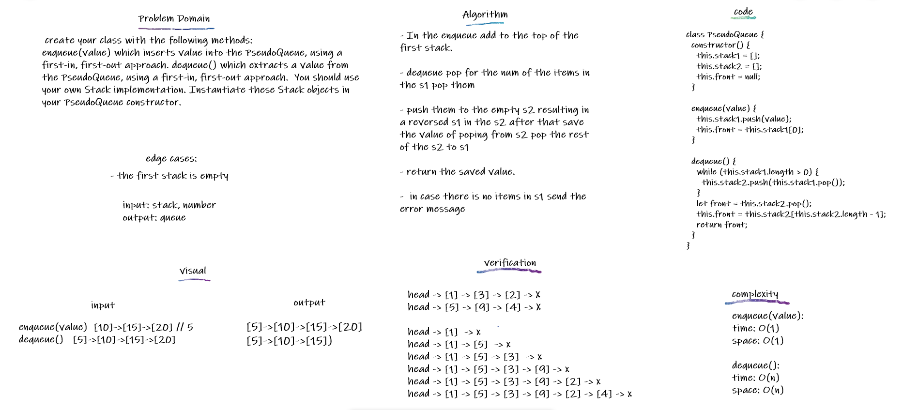

## Queue With Stacks

Implement a queue (a FIFO structure...first-in-first-out) only using stacks internally as efficiently as possible.

## Challenge

- create your class with the following methods:

  - enqueue(value) which inserts value into the PseudoQueue, using a first-in, first-out approach.
  - dequeue() which extracts a value from the PseudoQueue, using a first-in, first-out approach.

You should use your own Stack implementation. Instantiate these Stack objects in your PseudoQueue constructor.

## Approach & Efficiency

In the enqueue add to the top of the first stack, time=>O(1) space=>O(1)
In the dequeue used 2 loops and copied stack 2 to a variable, time=>O(n) space=>O(n)

## API

In the enqueue add to the top of the first stack simple as that In the dequeue pop for the num of the items in the s1 pop them and push them to the empty s2 resulting in a reversed s1 in the s2 after that save the value of poping from s2 pop the rest of the s2 to s1 then return the saved value in case there is no items in s1 send the error message

