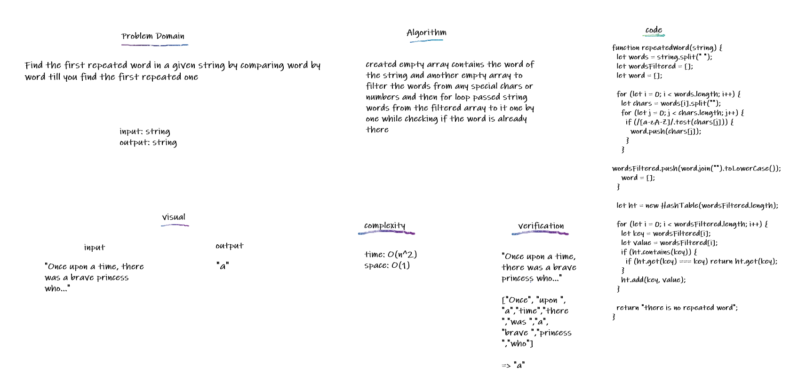

## Repeated Word

Find the first repeated word in a given string by comparing word by word till you find the first repeated one

## Challenge

Find the first repeated word in a given string.

## Approach & Efficiency

created empty array contains the word of the string and another empty array to filter the words from any special chars or numbers and then for loop passed string words from the filtered array to it one by one while checking if the word is already there
Big O of time --> O(n^2) Big O of space --> O(n)

## API

