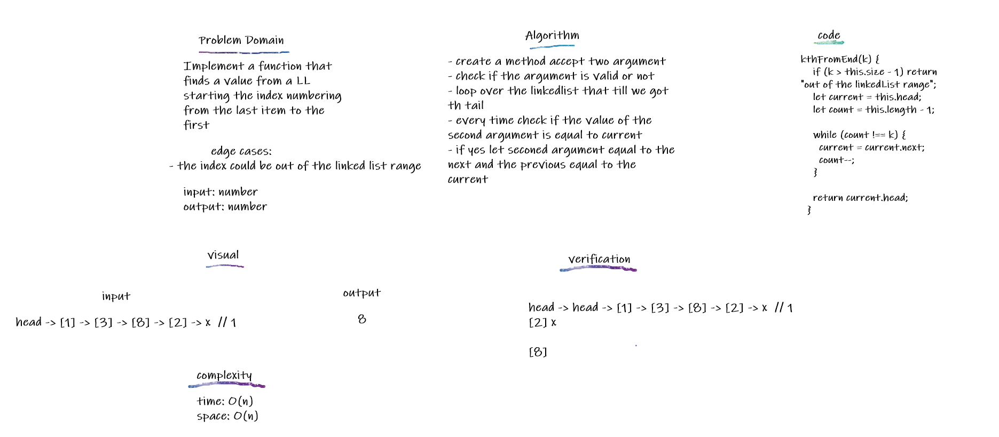

## Stacks and Queues

A stack is a data structure that consists of Nodes. Each Node references the next Node in the stack, but does not reference its previous.
A queue is an ordered collection of items where the addition of new items happens at one end, called the rear

## Challenge

Write stack and peek classes with their methods push, pop for stack, enqueue, dequeue for queue and peek,isEmpty for both of them.

## Approach & Efficiency

Create a Stack class contains:

- Define a method called push big O(1)
- Define a method called pop big O(1)
- Define a method called peek big O(1)
- Define a method called isEmpty big O(1)

Create a Queue class:

- Define a method called enqueue big O(1)
- Define a method called dequeue big O(1)
- Define a method called peek big O(1)
- Define a method called isEmpty big O(1)

## API

Create a Node class contains:

- properties for the value stored in the Node
- a pointer to the next node.

Create a Stack class contains:

- push that append new node to the end by reseting the top value
- pop that remove the top from the stack and return the value and set the top vale to the top.next
- peek that returns the top value without removing it
- isEmpty that returns a boolean indicating whether or not the stack is empty.

Create a Queue class:

- enqueue append new node to the end by using the rear and set the next value to it then set the rear
- dequeue removes the front value returns itand set the front to the next of it
- peek return the value of the front
- isEmpty returns a boolean indicating whether or not the queue is empty.

<!--  -->
