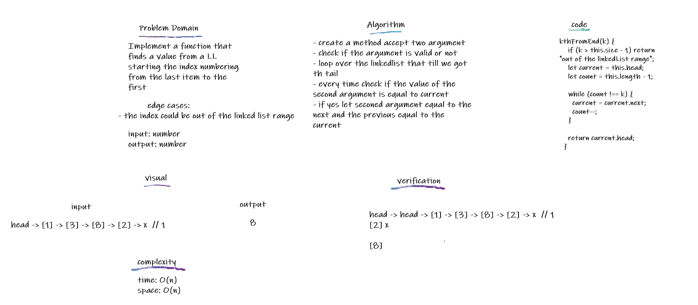
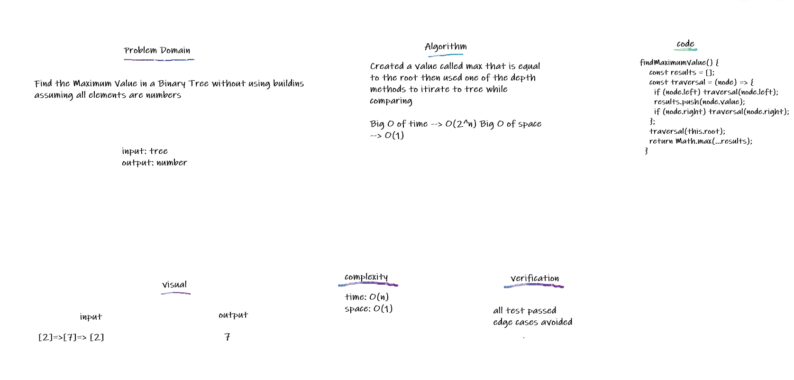
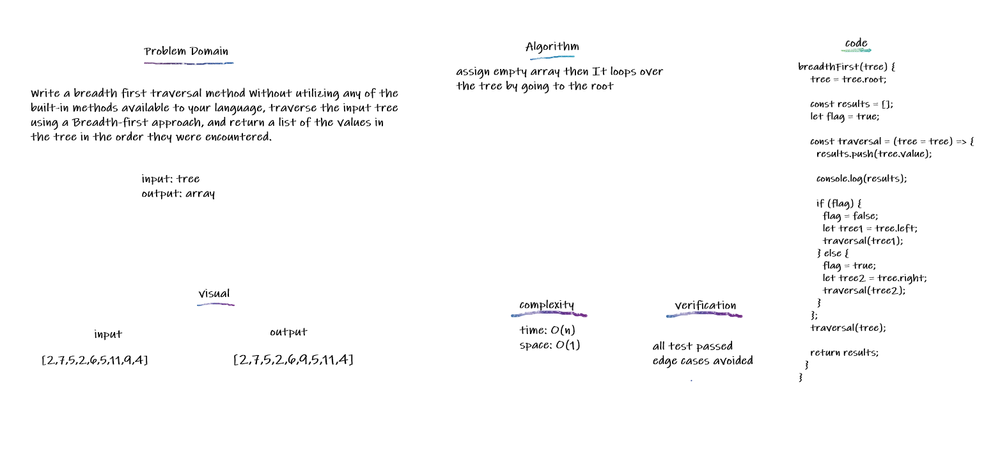

## Trees

A Tree is a data structure that consists of Nodes that form a tree like shape
Binary Trees is where every node has 2 childs at max

## Challenge

reate a BinaryTree class Define a method for each of the 3 depths:

- preOrder
- inOrder
- postOrder

Create a BinarySearchTree class Define a method named add that adds a new node with value to tree. Define a method named contains that accepts a value, and returns a boolean indicating whether or not the value is in the tree at least once.

## Approach & Efficiency

Create methods that uses recursion big O(2^n):

- preOrder
- inOrder
- postOrder
- add
- contains

## API

created a preOrder,inOrder and postOrder methods first assign empty array then It loops over the tree by going to the root append if preorder goes to the left node if exist and use the uses recursion then append if inorder then go to right if exist and uses recursion then append if postorder, In add it will assign root if it does not exist else will assign cueent as root then check if it is eqaul bigger or smaller than the current and add to it if not exist alse will navigate to the left or right same method applies to contain

<!--  -->

#####################################################################################

## Maximum Value

Find the Maximum Value in a Binary Tree

## Challenge

Find the Maximum Value in a Binary Tree without using buildins assuming all elements are numbers

## Approach & Efficiency

Created a value called max that is equal to the root then used one of the depth methods to itirate to tree while comparing

Big O of time --> O(2^n) Big O of space --> O(1)

## API

Created a value called max that is equal to the root then used preOrder methods to itirate to tree Nodes values, compare with the value saved in max then replace it if it is bigger then after the recursion ends i will have the max as the really max value in the tree and will return it

#####################################################################################

## Breadth First

Breadth-first Traversal throught the tree

## Challenge

Write a breadth first traversal method Without utilizing any of the built-in methods available to your language, traverse the input tree using a Breadth-first approach, and return a list of the values in the tree in the order they were encountered.

## Approach & Efficiency

assign empty array then It loops over the tree by going to the root

## API

