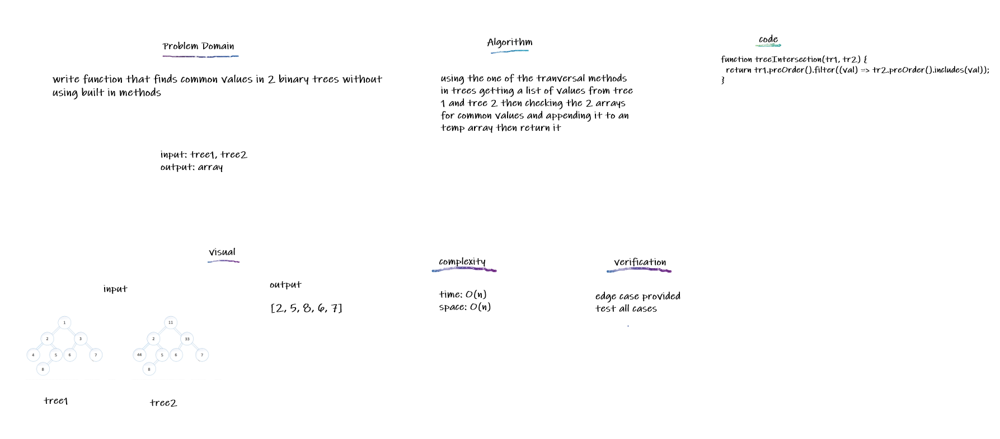

## Tree Intersection

BFind common values in 2 binary trees by navigation to values and checking them

## Challenge

write function that finds common values in 2 binary trees without using built in methods

## Approach & Efficiency

using the one of the tranversal methods in trees getting a list of values from tree 1 and tree 2 then checking the 2 arrays for common values and appending it to an temp array then return it
Big O of time --> O(n) Big O of space --> O(n)

## API

